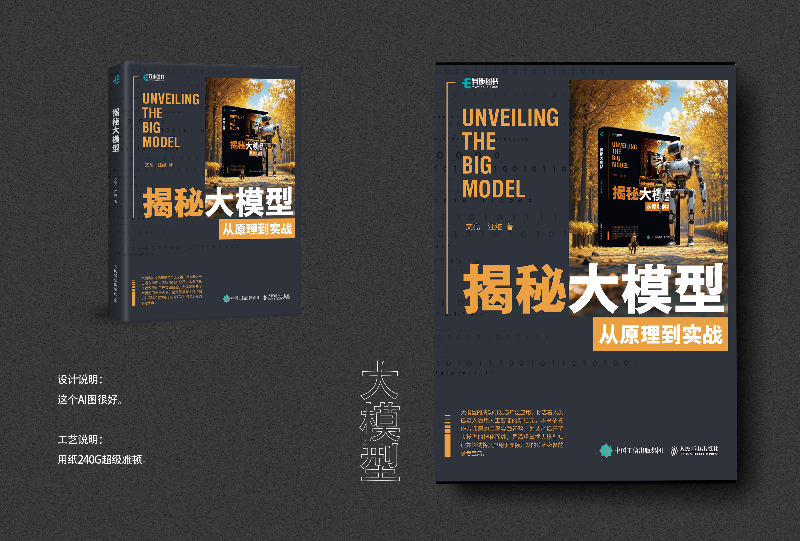

<h1 align="center">揭秘大模型：从原理到实战</h1>
<h3 align="left">第1章  大模型简介</h3>
<h3 align="left">第2章  大模型理论基础</h3>
<h3 align="left">第3章  OpenAI GPT系列大模型</h3>
<h3 align="left">第4章  清华大学通用预训练模型—GLM</h3>
<h3 align="left">第5章  Meta开源大模型—Llama</h3>
<h3 align="left">第6章  大模型参数高效微调</h3>
<h3 align="left">第7章  大模型指令微调</h3>
<h3 align="left">第8章  大模型训练优化</h3>
<h3 align="left">第9章  大模型推理优化</h3>
<h3 align="left">第10章  AIGC和大模型结合</h3>
<h3 align="left">第11章  大模型和推荐系统结合</h3>
<h3 align="left">第12章  构建私有大模型</h3>

