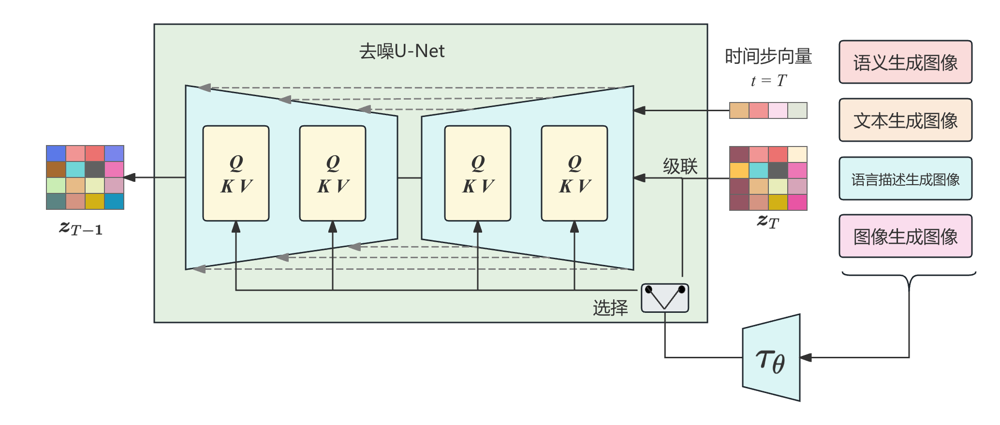
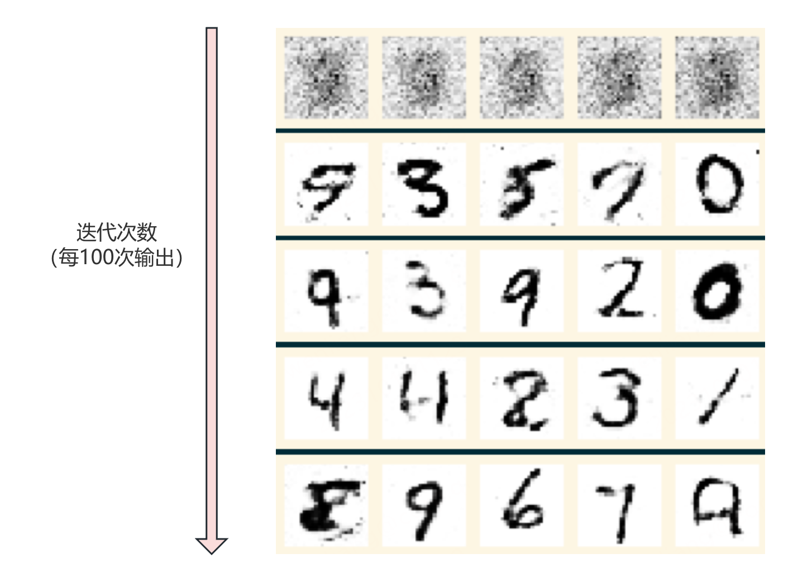
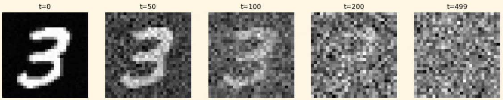
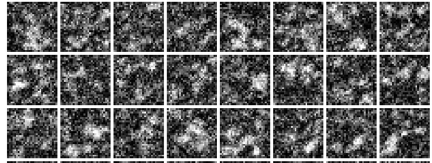

# Stable Diffusion
## 生成对抗网络实战—生成手写体数字图像
代码 [GAN.py](GAN.py) 实现了 GAN 的训练和生成，用于生产手写体数字，运行以下代码：
```text
python GAN.py
```
生成手写体数字：



## DDPM
执行代码 [forward_ddpm.py](forward_ddpm.py) ，可以看到 DDPM 的前向扩散过程的效果。
```text
python forward_ddpm.py
```



代码 [train_ddpm_resnet.py](train_ddpm_resnet.py) 实现了 DDPM 的训练过程，使用残差网络作为噪声估计函数。执行以下命令：
```text
python train_ddpm_resnet.py
```
可以看到生成的手写体数字：




