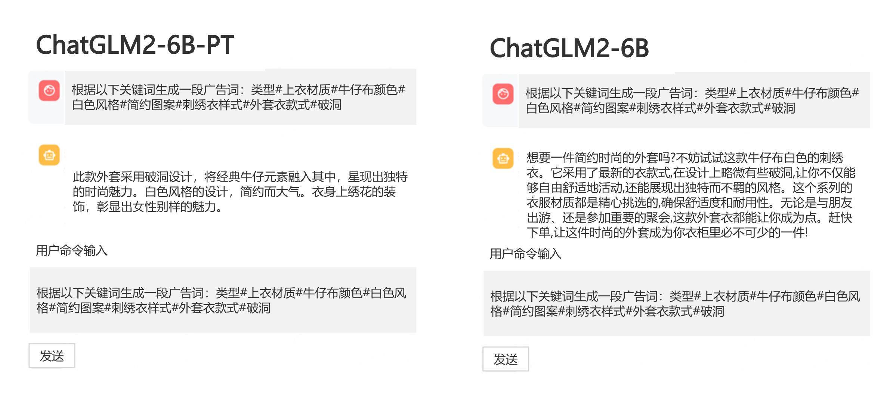

# Stable Diffusion
## 生成对抗网络实战—生成手写体数字图像
代码 [GAN.py](GAN.py) 实现了 GAN 的训练和生成，用于生产手写体数字，运行以下代码：
```text
python GAN.py
```


下载ChatGLM2-6B代码仓库：
```text
git clone https://github.com/THUDM/ChatGLM2-6B
cd ChatGLM2-6B
```
ChatGLM2-6B 模型测试：
```python
>>> from transformers import AutoTokenizer, AutoModel
>>> tokenizer = AutoTokenizer.from_pretrained("THUDM/chatglm2-6b", trust_remote_code=True)
>>> model = AutoModel.from_pretrained("THUDM/chatglm2-6b", trust_remote_code=True, device='cuda')
>>> model = model.eval()
>>> response, history = model.chat(tokenizer, "你好", history=[])
>>> print(response)
你好👋!我是人工智能助手ChatGLM2-6B,很高兴见到你,欢迎问我任何问题。
>>> response, history = model.chat(tokenizer, "晚上睡不着应该怎么办", history=history)
>>> print(response)
晚上睡不着可能会让你感到焦虑或不舒服,但以下是一些可以帮助你入睡的方法:

1.制定规律的睡眠时间表:保持规律的睡眠时间表可以帮助你建立健康的睡眠习惯,使你更容易入睡。尽量在每天的相同时间上床,并在同一时间起床。
2.创造一个舒适的睡眠环境:确保睡眠环境舒适,安静,黑暗且温度适宜。可以使用舒适的床上用品,并保持房间通风。
3.放松身心:在睡前做些放松的活动,例如泡个热水澡,听些轻柔的音乐,阅读一些有趣的书籍等,有助于缓解紧张和焦虑,使你更容易入睡。
4.避免饮用含有咖啡因的饮料:咖啡因是一种刺激性物质,会影响你的睡眠质量。尽量避免在睡前饮用含有咖啡因的饮料,例如咖啡,茶和可乐。
5.避免在床上做与睡眠无关的事情:在床上做些与睡眠无关的事情,例如看电影,玩游戏或工作等,可能会干扰你的睡眠。
6.尝试呼吸技巧:深呼吸是一种放松技巧,可以帮助你缓解紧张和焦虑,使你更容易入睡。试着慢慢吸气,保持几秒钟,然后缓慢呼气。

如果这些方法无法帮助你入睡,你可以考虑咨询医生或睡眠专家,寻求进一步的建议。
```
如果你的网络环境较差，下载模型参数可能会花费较长时间甚至失败。此时可以先将模型下载到本地，然后从本地加载。从HuggingFace Hub下载模型需要先安装Git LFS，然后执行如下命令。
```text
git clone https://huggingface.co/THUDM/chatglm2-6b
```
安装P-Tuning v2环境依赖：
```text
pip install rouge_chinese nltk jieba datasets
```
## 使用 P-Tuning v2 微调模型
在 [ChatGLM2-6B/ptuning](ChatGLM2-6B/ptuning)目录下执行命令：
```text
bash train.sh
```
加载微调后的模型：
```python
def get_model():
    tokenizer = AutoTokenizer.from_pretrained("THUDM/chatglm2-6b", trust_remote_code=True)
    config = AutoConfig.from_pretrained("THUDM/chatglm2-6b",trust_remote_code=True,pre_seq_len=128)
    model = AutoModel.from_pretrained("THUDM/chatglm2-6b", config=config, trust_remote_code=True)
    prefix_state_dict = torch.load(
        os.path.join("./ptuning/output/adgen-chatglm2-6b-pt-128-2e-2/checkpoint-3000",
        "pytorch_model.bin"))
    new_prefix_state_dict = {}
    for k, v in prefix_state_dict.items():
        if k.startswith("transformer.prefix_encoder."):
            new_prefix_state_dict[k[len("transformer.prefix_encoder."):]] = v

    model.transformer.prefix_encoder.load_state_dict(new_prefix_state_dict)
    model = model.eval()
    return tokenizer, model
```
执行以下命令，体验微调后的效果：
```text
streamlit run web_demo2.py
```



