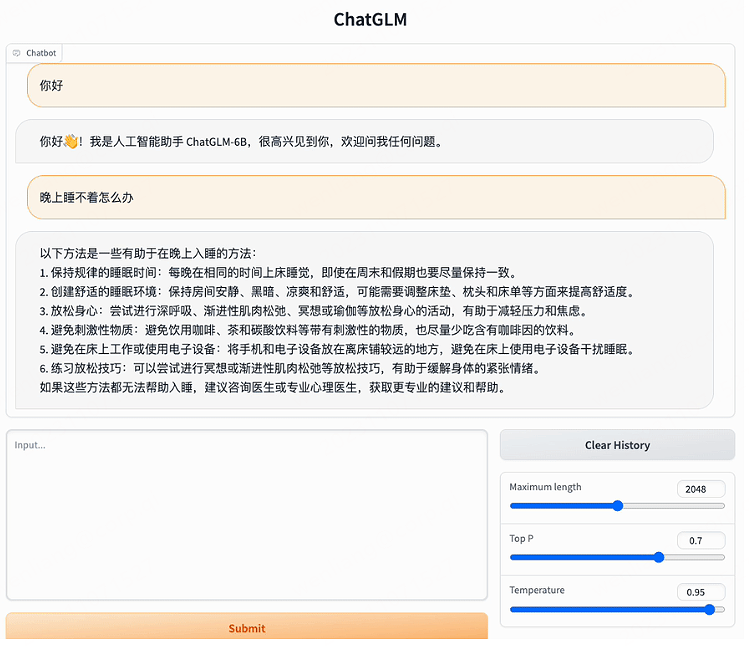
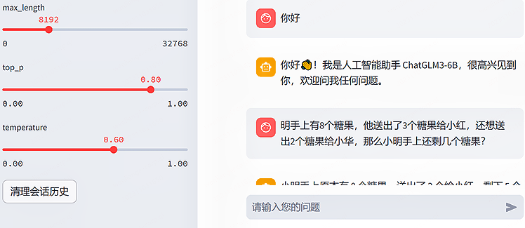
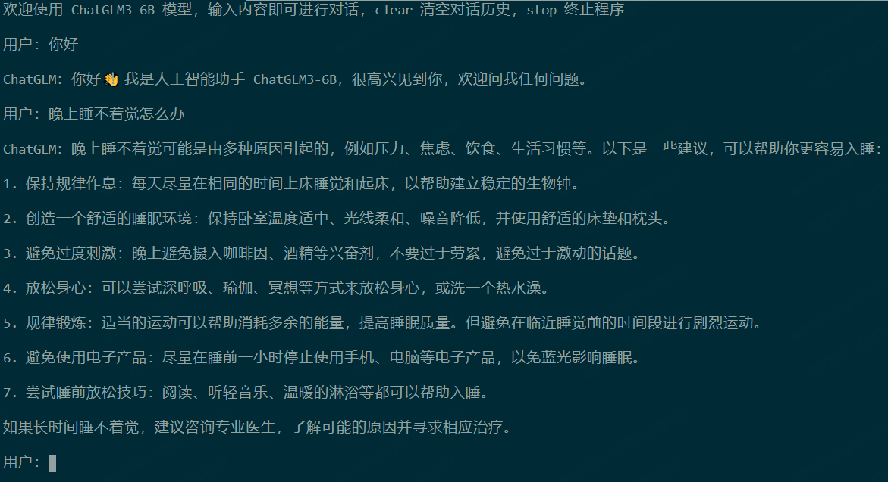
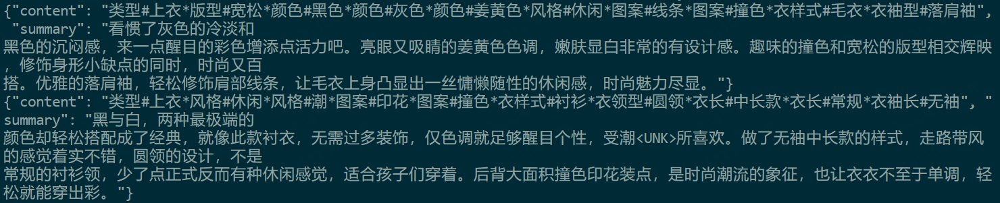

# 基于 ChatGLM3-6B 构建私有大模型
## 环境搭建
将 ChatGLM2-6B 微调代码复制到 ChatGLM3-6B 目录
```text
cp -r ChatGLM2-6B/ptuning ChatGLM3-6B/
```
安装相关依赖：
```text
pip install -r requirements.txt
```
其中，transformers库版本推荐为4.30.2，torch推荐使用2.0及以上的版本，以获得最佳的推理性能。
## 代码调用
```python
>>> from transformers import AutoTokenizer, AutoModel
>>> tokenizer = AutoTokenizer.from_pretrained("THUDM/chatglm3-6b", trust_remote_code=True)
>>> model = AutoModel.from_pretrained("THUDM/chatglm3-6b", trust_remote_code=True, device='cuda')
>>> model = model.eval()
>>> response, history = model.chat(tokenizer, "你好", history=[])
>>> print(response)
你好👋!我是人工智能助手ChatGLM3-6B,很高兴见到你,欢迎问我任何问题。
>>> response, history = model.chat(tokenizer, "晚上睡不着应该怎么办", history=history)
>>> print(response)

晚上睡不着可能会让你感到焦虑或不舒服,但以下是一些可以帮助你入睡的方法:
	
制定规律的睡眠时间表:保持规律的睡眠时间表可以帮助你建立健康的睡眠习惯,使你更容易入睡。尽量在每天的相同时间上床,并在同一时间起床。
创造一个舒适的睡眠环境:确保睡眠环境舒适,安静,黑暗且温度适宜。可以使用舒适的床上用品,并保持房间通风。
放松身心:在睡前做些放松的活动,例如泡个热水澡,听些轻柔的音乐,阅读一些有趣的书籍等,有助于缓解紧张和焦虑,使你更容易入睡。
避免饮用含有咖啡因的饮料:咖啡因是一种刺激性物质,会影响你的睡眠质量。尽量避免在睡前饮用含有咖啡因的饮料,例如咖啡,茶和可乐。
避免在床上做与睡眠无关的事情:在床上做些与睡眠无关的事情,例如看电影,玩游戏或工作等,可能会干扰你的睡眠。
尝试呼吸技巧:深呼吸是一种放松技巧,可以帮助你缓解紧张和焦虑,使你更容易入睡。试着慢慢吸气,保持几秒钟,然后缓慢呼气。
如果这些方法无法帮助你入睡,你可以考虑咨询医生或睡眠专家,寻求进一步的建议。
```
## 网页版示例
启动一个基于Gradio的网页版示例：
```text
python web_demo.py
```



除了上面的方式，还可以通过如下命令，启动一个基于Streamlit的网页版示例。
```text
streamlit run web_demo2.py
```



## 命令行示例
还可以通过命令行启动：
```text
python cli_demo.py
```



## 低成本部署
模型默认以FP16精度加载，需要约13 GB的显存。如果您的GPU显存不足，可以选择以量化方式加载模型，具体方法如下：
```python
model = AutoModel.from_pretrained("THUDM/chatglm3-6b",trust_remote_code=True).quantize(4)
```
也可以在CPU上运行模型，但是推理速度会慢很多。具体方法如下（需要至少32 GB的内存）：
```python
model = AutoModel.from_pretrained("THUDM/chatglm3-6b", trust_remote_code=True).float()
```
如果您的Mac使用了Apple Silicon或AMD GPU，可以使用MPS后端在GPU上运行ChatGLM3-6B。
```python
model = AutoModel.from_pretrained("your local path", trust_remote_code=True).to('mps')
```
如果您有多张GPU，但是每张GPU的显存都不够加载完整的模型，您可以使用模型并行的方式，将模型分配到多张GPU上。
```python
from utils import load_model_on_gpus
model = load_model_on_gpus("THUDM/chatglm3-6b", num_gpus=2)
```

## 微调 ChatGLM3-6B
### 数据准备
下载ADGEN数据集，这是一个用于生成广告文案的数据集。ADGEN数据集的任务是根据输入的商品信息生成一段吸引人的广告词。把AdvertiseGen文件夹里的数据分成训练集和验证集，分别保存为train.json和dev.json文件，数据的格式如下：



### 环境安装
要进行全参数微调，您需要先安装deepspeed，还需要安装一些有监督微调需要的包。
```text
pip install deepspeed
cd ptuning
pip install rouge_chinese nltk jieba datasets
```
修改微调代码中的相关参数
```text
vim ds_train_finetune.sh
LR=1e-5
MASTER_PORT=$(shuf -n 1 -i 10000-65535)
deepspeed --num_gpus=8 --master_port $MASTER_PORT main.py \
    --deepspeed deepspeed.json \
    --do_train \
    --preprocessing_num_workers 32 \
    --train_file AdvertiseGen/train.json \
    --test_file AdvertiseGen/dev.json \
    --prompt_column content \
    --response_column summary \
    --model_name_or_path ../models/chatglm3-6b \
    --output_dir output/adgen-chatglm3-6b-ft \
    --overwrite_output_dir \
    --max_source_length 512 \
    --max_target_length 512 \
    --per_device_train_batch_size 16 \
    --per_device_eval_batch_size 1 \
    --gradient_accumulation_steps 1 \
    --predict_with_generate \
    --logging_steps 10 \
    --save_steps 1000 \
    --learning_rate $LR \
    --fp16
```
各个参数的含义如下表所示：
