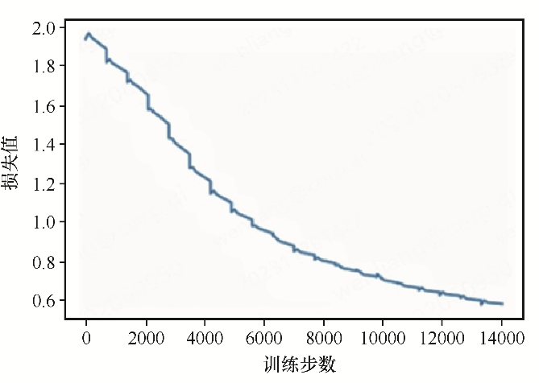
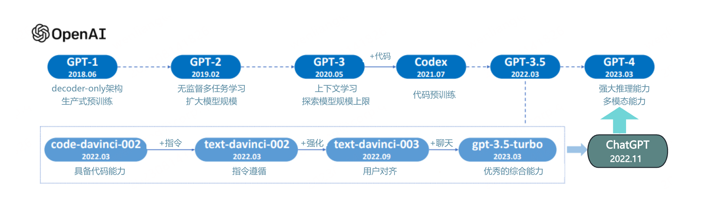

# GPT实现文本分类和生成
## 环境安装
```python
pip install tensorflow
```
## Transformer实现
代码文件 [transformer.py](transformer.py) 实现了 Transformer。
## 使用 Transformer 实现葡萄牙语翻译为英文
代码文件 [trans_port_to_eng.py](trans_port_to_eng.py) 实现了葡萄牙语翻译为英文。\
运行命令：
```python
python trans_port_to_eng.py
```
可以看到以下输出：
```python
输入: este é um problema que temos que resolver.
预测输出: this is a problem that we have to deal with .
真实输出: this is a problem we have to solve .
```
模型训练过程中的loss曲线：


## 使用 Transformer 实现英译汉
代码文件 [trans_eng_to_ch.py](trans_eng_to_ch.py) 实现了英译汉。\
运行命令
```python
python trans_eng_to_ch.py
```
可以看到以下输出：
```python
输入: let s take a bus
预测输出: 讓 我們 坐 公共 汽車 去
真实输出：讓 我們 搭公車 吧
***********
输入: you don t understand
预测输出: 你 不 懂
真实输出：你 不 了解
***********
输入: you don t have to raise your voice
预测输出: 你 不 需要 提高 你 的 音量
真实输出：您 不 需要 提高 音量
***********
输入: that makes no sense at all
预测输出: 这 没有 任何 意义的
真实输出：这 没有 任何 意义
```




