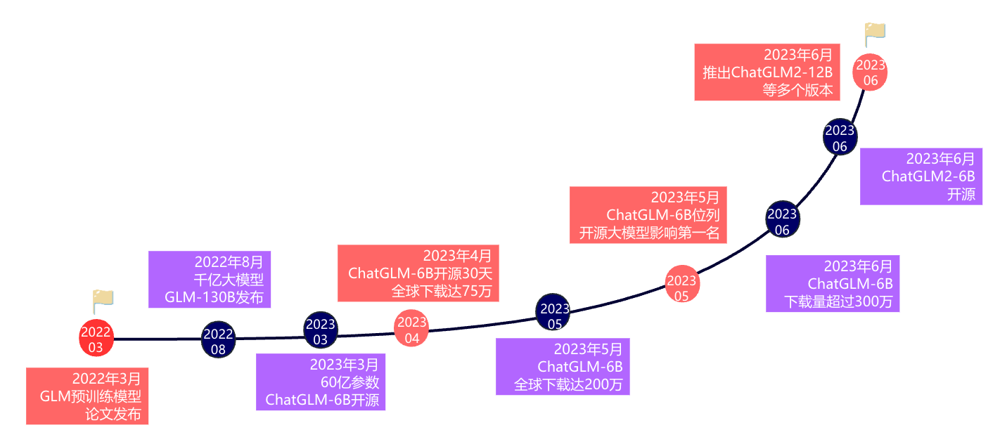

# 全参数微调 GLM
## 环境搭建
下表列出了 GPU 配置的相关环境（备注：表中是 ChatGLM-6B 全参数微调的配置，如果是 LORA 微调，单卡 A100 40GB 就可以。）。

| 配置项 | 参数 |
| --- | --- |
| 操作系统 | CentOS 7 | 
| GPU版本 | 8卡A100 80GB GPUs | 
| Python版本 | >=3.10 |
| NIVIDIA驱动程序版本 | 515.65.01 |
| CUDA工具包 | 11.7 |
| NCCL | nccl_2.14.3-1+cuda11.7 |
| cuDNN | 8.8.1.3_cuda 11 |

安装CUDA
```text
vim ~/.bashrc
export PATH=/usr/local/cuda/bin:$PATH
export LD_LIBRARY_PATH=/usr/local/cuda/lib64:$LD_LIBRARY_PATH
```
安装cuDNN
```text
sudo cp cudnn-linux-x86_64-8.8.0.121_cuda11-archive/include/cudnn*.h /usr/local/cuda/include/
sudo cp cudnn-linux-x86_64-8.8.0.121_cuda11-archive/lib/libcudnn* /usr/local/cuda/lib64/
sudo chmod a+r /usr/local/cuda/include/cudnn*.h /usr/local/cuda/lib64/libcudnn*
export LD_LIBRARY_PATH=/usr/local/cuda/lib64:$LD_LIBRARY_PATH
```
安装PyTorch
```text
vim requirements.txt
protobuf>=3.19.5,<3.20.1
transformers>=4.26.1
icetk
cpm_kernels
gradio
pip install —user -r requirements.txt
pip install —user torch==1.10.0+cu111 torchvision==0.11.0+cu111 torchaudio==0.10.0 -f torch-1.10.0+cu111-cp39-cp39-linux_x86_ 64.whl -f torchvision-0.11.0+cu111-cp39-cp39-linux_x86_64.whl -f torchaudio-0.10.0+cu111-cp39-cp39- linux_x86_64.whl
```
## 全参数微调 ChatGLM-6B


## GPT1 实现文本分类
代码文件 [gpt1.py](gpt1.py) 实现了 GPT1，[train_gpt1.py](train_gpt1.py) 实现了 GPT1 模型训练。运行 [train_gpt1.py](train_gpt1.py) 可以实现模型训练，并生成训练后的效果。
### 数据准备
我们从 [GitHub - BenDerPan/toutiao-text-classfication-dataset: 今日头条中文新闻（文本）分类数据集](https://link.zhihu.com/?target=https%3A//github.com/BenDerPan/toutiao-text-classfication-dataset) 网址里面下载数据，数据来自今日头条客户端。

数据格式如下：
```text
6552431613437805063_!_102_!_news_entertainment_!_谢娜为李浩菲澄清网络谣言，之后她的两个行为给自己加分_!_佟丽娅,网络谣言,快乐大本营,李浩菲,谢娜,观众们
```
每行为一条数据，以_!_分割的个字段，从前往后分别是：新闻ID、分类code（见下文）、分类名称（见下文）、新闻字符串（仅含标题）、新闻关键词。

分类code与名称：
```text
100 民生 故事 news_story
101 文化 文化 news_culture
102 娱乐 娱乐 news_entertainment
103 体育 体育 news_sports
104 财经 财经 news_finance
106 房产 房产 news_house
107 汽车 汽车 news_car
108 教育 教育 news_edu
109 科技 科技 news_tech
110 军事 军事 news_military
112 旅游 旅游 news_travel
113 国际 国际 news_world
114 证券 股票 stock
115 农业 三农 news_agriculture
116 电竞 游戏 news_game
```
整个数据集共有382688条，分布于15个分类中。
### 模型训练与测试
运行代码：
```python
python train_gpt1.py
```
输出训练过程中的日志：
```text
epoch 20, batch 0, loss:3.8556, loss_fine:0.5126, acc:0.8906
epoch 20, batch 1000, loss:3.6283, loss_fine:0.2713, acc:0.9259
epoch 20, batch 2000, loss:3.6260, loss_fine:0.2715, acc:0.9256
epoch 20, batch 3000, loss:3.6289, loss_fine:0.2736, acc:0.9248
epoch 20, batch 4000, loss:3.6265, loss_fine:0.2719, acc:0.9251
epoch 20, save model at ./checkpoint/train_cat/ckpt-10
```
同时，输出给定文本的分类结果：
```text
输入:《狂飙》结局后，张译终于发声了，剧中演员回应一辈子不想见张译
预测输出: 娱乐
==============================================================
输入:教育部下发新通知，将调整今年的高考方向，家长看完心态“崩”了
预测输出: 教育
==============================================================
输入:俄罗斯学会了，发射大批气球飞向乌克兰，乌军导弹快不够用了
预测输出: 军事
```
## GPT2 实现文本分类与生成
代码文件 [gpt2.py](gpt2.py) 实现了 GPT2，[train_gpt2.py](train_gpt2.py) 实现了 GPT2 模型训练。运行 [train_gpt2.py](train_gpt2.py) 可以实现模型训练，并生成训练后的效果。数据使用和 GPT1 相同的数据。
### 模型训练与测试
运行代码：
```python
python train_gpt2.py
```
代码会生成文本分类的测试结果：
```text
真实数据： 女子称与母亲长期遭受男友虐待不堪凌辱联合母亲将男友杀害|国际
输入: 女子称与母亲长期遭受男友虐待不堪凌辱联合母亲将男友杀害
预测输出: 女子称与母亲长期遭受男友虐待不堪凌辱联合母亲将男友杀害|国际
============================
真实数据： 你玩《刺激战场》会有的三大幻觉是什么？|电竞
输入: 你玩《刺激战场》会有的三大幻觉是什么？
预测输出: 你玩《刺激战场》会有的三大幻觉是什么？是什么？|电竞
============================
真实数据： 从大阪机场直接去奈良或者京都要怎么去？|旅游
输入: 从大阪机场直接去奈良或者京都要怎么去？
预测输出: 从大阪机场直接去奈良或者京都要怎么去？和三亚？|旅游
============================
真实数据： 买ps4的你后悔了吗？|电竞
输入: 买ps4的你后悔了吗？
预测输出: 买ps4的你后悔了吗？了吗？|电竞
```
下面是代码输出的文本生成效果：
```text
输入: 杨幂景甜
预测输出: 杨幂景甜亮相某活动，网友：这是要穿出了吗？|娱乐
============================
输入: 整容狂人
预测输出: 整容狂人被吐槽丑，网友：这是要被骗了|娱乐
============================
输入: 北大校长口误
预测输出: 北大校长口误的字，你知道吗？|教育
============================
```


